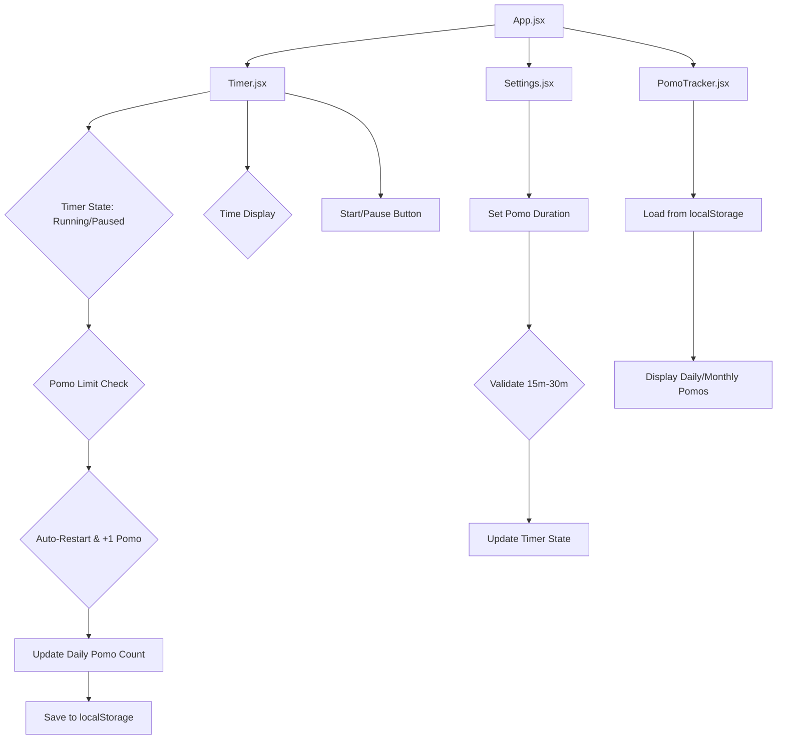

# Project Plan: React Pomodoro Timer

### **I. Project Setup & Initial Structure**

1.  **Initialize React Project:**
    - Create a new React project using Vite for a lightweight and fast development experience.
    - `npm create vite@latest pomotee -- --template react`
    - `cd pomotee`
    - `npm install`
2.  **Clean Up Boilerplate:** Remove unnecessary files and code from the default Vite/React setup.
3.  **Core Components:**
    - Create `App.jsx` (main component).
    - Create `Timer.jsx` (for displaying the timer and controls).
    - Create `PomoTracker.jsx` (for displaying daily/monthly pomo counts).
    - Create `Settings.jsx` (for setting pomo limit).
    - Create `utils/localStorage.js` (for `localStorage` interactions).
    - Create `App.css` or `index.css` for global styles.

### **II. Core Pomodoro Logic & UI**



1.  **`App.jsx`:**
    - Manage global state for `pomoDuration`, `currentPomoCount`, `timerRunning`, `timeRemaining`, and `dailyPomos`.
    - Pass state and setter functions as props to child components.
2.  **`Timer.jsx`:**
    - Receive `timeRemaining`, `timerRunning`, `startTimer`, `pauseTimer` as props.
    - Display `timeRemaining` prominently.
    - Implement "Start" and "Pause" buttons.
    - Use `useEffect` to manage the countdown interval.
    - **Pomo Limit & Auto-Restart Logic:**
      - When `timeRemaining` hits 0, check if `timerRunning` is true.
      - If so, increment `currentPomoCount`, reset `timeRemaining` to `pomoDuration`, and trigger a daily pomo update.
3.  **`Settings.jsx`:**
    - Provide an input field for the user to set the `pomoDuration`.
    - Implement validation to ensure the duration is between 15 and 30 minutes.
    - Update the `pomoDuration` state in `App.jsx`.

### **III. Data Persistence & Tracking (Revised)**

```mermaid
graph TD
    A[App.jsx] --> B{Current Day Pomo State}
    B --> C[localStorage.js]
    C --> D[Save Current Day Pomos (Detailed)]
    E[Timer.jsx] --> F{Pomo Start/Pause/Complete}
    F --> C
    G[PomoTracker.jsx] --> C
    C --> H[Load Current Day Pomos (Detailed)]
    C --> I[Load Past Days Pomos (Summary)]
    I --> J[Display Daily/Monthly Pomos]
    D --> K{Data Cleanup: Keep 2 Months}
```

1.  **`utils/localStorage.js`:**

    - **Data Structure:**
      - **Current Day:** Store an array of pomo objects for the current day. Each object will look like:
        ```json
        {
            "startTime": "ISOString",
            "completed": true/false,
            "endTime": "ISOString" // Only if completed is false
        }
        ```
        The key in `localStorage` could be `current_day_pomos_YYYY-MM-DD`.
      - **Past Days:** Store a summary for past days, e.g., `daily_pomos_summary_YYYY-MM-DD: count`.
      - **Monthly Data:** The `loadMonthlyPomos` function will aggregate these daily summaries.
    - `saveCurrentDayPomos(date, pomoArray)`: Saves the detailed array of pomo objects for the current day.
    - `loadCurrentDayPomos(date)`: Loads the detailed array of pomo objects for the current day.
    - `saveDailyPomoSummary(date, count)`: Saves the total count of _completed_ pomos for a past day.
    - `loadDailyPomoSummary(date)`: Retrieves the summary count for a specific past date.
    - `loadMonthlyPomos(month, year)`: Iterates through `localStorage` keys to gather all daily pomo _summary_ counts for a given month.
    - `cleanupOldPomos()`: A function to be called periodically (e.g., on app load) to remove pomo data older than two months. This will involve iterating through `localStorage` keys and deleting those that fall outside the current and previous month.

2.  **`App.jsx`:**

    - Manage `currentDayPomos` state (array of detailed pomo objects).
    - On app load, check `localStorage` for an incomplete pomo for the current day and resume the timer if found.
    - When a pomo is completed, update `currentDayPomos` and also update the daily summary for the current day.
    - Call `cleanupOldPomos` from `utils/localStorage.js` on app initialization.

3.  **`Timer.jsx`:**

    - When starting a pomo, add a new pomo object to `currentDayPomos` with `startTime` and `completed: false`.
    - When pausing, update the current pomo object with `endTime`.
    - When a pomo completes, update the current pomo object with `completed: true` and `endTime`.
    - Logic to resume an incomplete pomo on page refresh.

4.  **`PomoTracker.jsx`:**
    - Display the current day's _completed_ pomo count (derived from `currentDayPomos`).
    - Load and display monthly pomo summaries from `localStorage`.

### **IV. UI/UX & Styling**

1.  **Basic Styling:** Apply minimal CSS to make the timer, buttons, and tracking sections clear and readable.
2.  **Theme Color Changes:**
    - Define two main theme colors (e.g., `pomo-active-color`, `pomo-inactive-color`).
    - Use CSS variables or dynamic class names based on the `timerRunning` state to change the background or accent color of the application.

### **V. Refinement & Testing**

1.  **Input Validation:** Add robust validation for the pomo duration input.
2.  **Error Handling:** Gracefully handle potential `localStorage` errors.
3.  **User Feedback:** Provide visual cues (e.g., button states, subtle animations) for timer actions.
4.  **Cross-Browser Compatibility:** Ensure functionality across major browsers.
